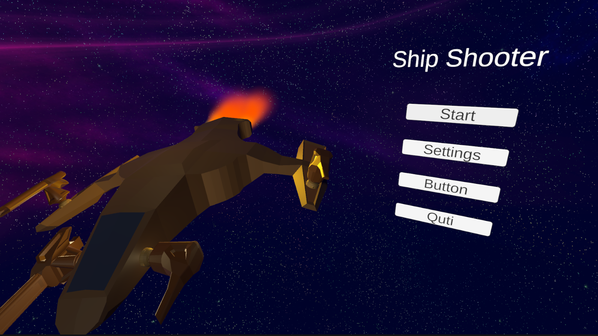
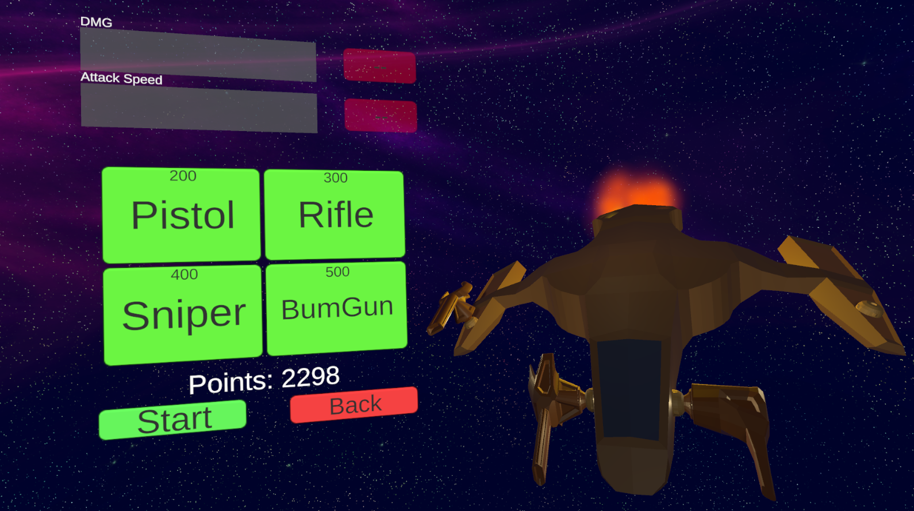
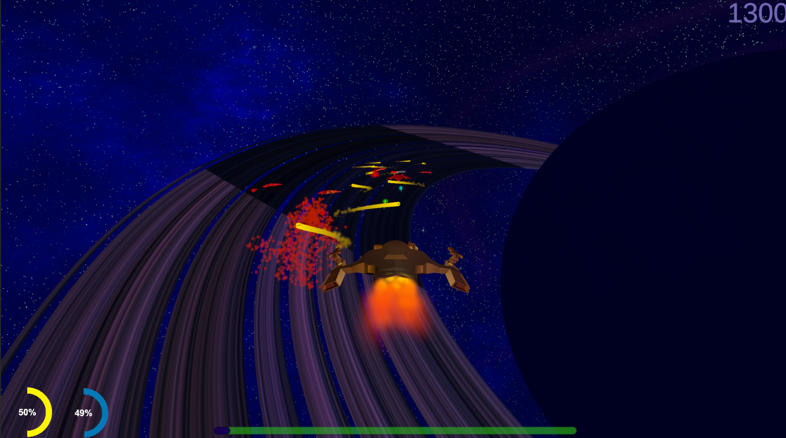

# Ship Shooter

Ship Shooter is a dynamic 3D game created using the Unity game engine, where players take control of a spaceship and strive to survive attacks from diverse enemies.
The goal is to survive to the next phase and destroy incoming enemies. The game features an elaborate in-game store system that allows players to upgrade their spaceship, weapons, and purchase new armaments.

# Screenshots

# Key Features

- Upgrade System :Improve your spaceship's performance by investing in upgrades. Upgrade your ship's attributes, enhance weapons, and unlock new and powerful armaments.
- In-Game Store: Visit the store to purchase upgrades and new weapons using in-game currency earned through successful missions and enemy takedowns.
- Diverse Enemies: Encounter different types of enemies, each presenting distinct challenges. Adapt your strategy to overcome varying threats and survive the onslaught.

  
